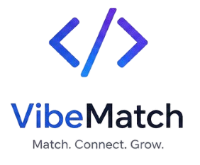

<div align="center">



# VibeMatch

### Swipe Into Your Next Dev Circle

A full-stack developer networking platform — swipe through profiles, send connection requests, chat in real-time, and manage your community with a built-in admin dashboard.

[](https://vibe-match-platform.vercel.app)
[](https://vibematch-xxoe.onrender.com)
[](LICENSE)
[](https://nodejs.org)
[](https://nextjs.org)

</div>

---

## Table of Contents

- [Overview](#overview)
- [Tech Stack](#tech-stack)
- [Features](#features)
- [Project Structure](#project-structure)
- [Getting Started](#getting-started)
- [Environment Variables](#environment-variables)
- [Available Scripts](#available-scripts)
- [API Reference](#api-reference)
- [Real-time Events](#real-time-events)
- [Deployment](#deployment)
- [CI/CD](#cicd)
- [Making a User Admin](#making-a-user-admin)
- [License](#license)

---

## Overview

VibeMatch is a **Tinder-style developer networking app** where engineers discover each other by swiping through profile cards, send connection requests, and chat in real-time once matched. It ships with a full admin dashboard for platform management and Razorpay-powered premium subscriptions.

---

## Tech Stack

| Layer | Technology |
|---|---|
| **Frontend** | Next.js 15 (App Router), TypeScript, Tailwind CSS v4, DaisyUI v5 |
| **UI / Motion** | Framer Motion, Lucide React, Recharts |
| **State** | Redux Toolkit, React Redux |
| **Backend** | Node.js 20, Express 5, MongoDB (Mongoose 8) |
| **Real-time** | Socket.IO v4 (chat + online presence + heartbeat) |
| **Auth** | JWT (httpOnly cookies), GitHub OAuth, Google OAuth |
| **Payments** | Razorpay (orders + webhooks) |
| **Media** | Cloudinary (auto-optimized uploads via `upload_stream`) |
| **Docs** | Swagger / OpenAPI 3.0 (dev only) |
| **Logging** | Winston + Morgan |
| **Validation** | Joi (backend), TypeScript (frontend) |
| **CI/CD** | GitHub Actions → Vercel (frontend) + Render (backend) |
| **Containers** | Docker (multi-stage frontend, single-stage backend) |

---

## Features

### Swipe Feed
- Framer Motion drag gestures — swipe right to connect, left to skip
- Cursor-based infinite scroll pagination (no skip cost, no duplicates)
- `IntersectionObserver` sentinel auto-loads next page
- Side queue panel shows upcoming profiles
- Banned users excluded from feed

### Real-time Chat
- Socket.IO 1:1 messaging persisted to MongoDB
- Message grouping by date with Today / Yesterday / date separators
- Bubble border-radius morphing (iMessage-style)
- Online presence indicator + last-seen timestamps
- Heartbeat every 30s keeps `lastSeen` fresh

### Connection System
- Send / accept / reject connection requests
- Connections list with online status dots and last-seen
- Search filter across connections
- Live badge counts in NavBar (amber for requests, indigo for connections)

### Profile & Image Upload
- Edit profile with drag-and-drop photo upload
- Cloudinary v2 `upload_stream` — auto `800×800` crop, `quality: auto`, `fetch_format: auto`
- Max 5 MB, JPG / PNG / WebP
- DiceBear `bottts-neutral` fallback avatars

### Premium Subscriptions
- Razorpay order creation + webhook verification
- Silver / Gold / Diamond plans
- Premium status check endpoint

### Admin Dashboard
- Protected by `isAdmin` flag — no UI to set it (MongoDB only)
- **Overview tab:** total revenue (₹), DAU, total matches, 30-day revenue area chart, 30-day DAU bar chart
- **Users tab:** searchable paginated table with ban / unban controls

### Theme System
- Dark (default) + Light themes via `next-themes`
- CSS custom properties (`var(--brand)`, `var(--bg-base)`, etc.)
- Smooth 250ms transitions

---

## Project Structure

```
VibeMatch/
├── .github/
│   └── workflows/
│       ├── frontend.yml      # Lint + typecheck → Vercel (Git integration)
│       └── backend.yml       # Lint → Render deploy hook
├── backend-app/
│   ├── Dockerfile
│   ├── .dockerignore
│   └── src/
│       ├── config/           # DB, JWT, Cloudinary, Razorpay, logger, morgan
│       ├── controllers/      # auth, user, request, payment, chat, admin, upload
│       ├── middlewares/      # userAuth, adminAuth, validate, error
│       ├── models/           # User, ConnectionRequest, Chat, Payment
│       ├── routes/v1/        # All API routes with Swagger JSDoc
│       ├── services/         # Business logic layer
│       ├── utils/            # socket.js, ApiError, catchAsync, constants
│       └── validations/      # Joi schemas
└── frontend-app/
    ├── Dockerfile
    ├── .dockerignore
    ├── app/
    │   ├── page.tsx              # Landing page (public)
    │   ├── feed/                 # Infinite-scroll swipe feed
    │   ├── login/                # Login (email + GitHub + Google)
    │   ├── signup/               # Signup
    │   ├── profile/              # Edit profile + image upload
    │   ├── connections/          # Connections with last-seen + search
    │   ├── requests/             # Incoming connection requests
    │   ├── chat/
    │   │   ├── page.tsx          # Conversations list
    │   │   └── [targetUserId]/   # Real-time 1:1 chat
    │   ├── premium/              # Razorpay subscription plans
    │   └── admin/                # Admin dashboard (isAdmin only)
    ├── api/                      # Axios API layer (typed, 11 files)
    ├── components/               # NavBar, Footer, EditProfile, HeartbeatProvider, ThemeToggle
    ├── redux/                    # Store + 4 slices (user, feed, connections, requests)
    ├── types/                    # Shared TypeScript interfaces
    └── utils/                    # socket.ts, constants.ts
```

---

## Getting Started

### Prerequisites

- Node.js 20+
- MongoDB Atlas cluster (or local MongoDB)
- Razorpay account (test mode works)
- Cloudinary account (free tier works)
- Optional: GitHub / Google OAuth apps

### Backend

```bash
cd backend-app
cp .env.example .env    # fill in your values
npm install
npm run dev             # http://localhost:7777
```

### Frontend

```bash
cd frontend-app
cp .env.local.example .env.local    # fill in your values
npm install
npm run dev                          # http://localhost:3000
```

---

## Environment Variables

### Backend — `backend-app/.env`

```env
NODE_ENV=development
PORT=7777
MONGO_URI=mongodb+srv://<user>:<pass>@cluster.mongodb.net/vibeMatch
JWT_SECRET=your_strong_jwt_secret
JWT_ACCESS_EXPIRATION_DAYS=7
CLIENT_ORIGIN=http://localhost:3000

RAZORPAY_KEY_ID=rzp_test_...
RAZORPAY_KEY_SECRET=...
RAZORPAY_WEBHOOK_SECRET=...

CLOUDINARY_CLOUD_NAME=your_cloud_name
CLOUDINARY_API_KEY=your_api_key
CLOUDINARY_API_SECRET=your_api_secret
```

### Frontend — `frontend-app/.env.local`

```env
NEXT_PUBLIC_BACKEND_URL=http://localhost:7777
```

---

## Available Scripts

### Frontend (`frontend-app/`)

| Script | Description |
|---|---|
| `npm run dev` | Start development server |
| `npm run build` | Production build |
| `npm run start` | Start production server |
| `npm run lint` | ESLint (Next.js rules) |
| `npm run compile-ts` | TypeScript type-check without emit |

### Backend (`backend-app/`)

| Script | Description |
|---|---|
| `npm run dev` | Start with nodemon (development) |
| `npm run start` | Production start |
| `npm run lint` | ESLint (Airbnb-base rules) |
| `npm run lint:fix` | Auto-fix ESLint errors |
| `npm run prettier` | Prettier format check |
| `npm run prettier:fix` | Auto-fix formatting |

---

## API Reference

Swagger UI available at **`http://localhost:7777/api/docs`** (development only).

All endpoints are prefixed with `/api/v1`.

### Auth

| Method | Endpoint | Auth | Description |
|---|---|---|---|
| `POST` | `/api/v1/signup` | — | Register new user |
| `POST` | `/api/v1/login` | — | Email + password login |
| `POST` | `/api/v1/logout` | — | Clear session cookie |

### Profile

| Method | Endpoint | Auth | Description |
|---|---|---|---|
| `GET` | `/api/v1/profile/view` | ✅ | Get own profile |
| `PUT` | `/api/v1/profile/edit` | ✅ | Update profile fields |
| `POST` | `/api/v1/heartbeat` | ✅ | Update `lastSeen` timestamp |

### Feed & Users

| Method | Endpoint | Auth | Description |
|---|---|---|---|
| `GET` | `/api/v1/feed?cursor=&limit=` | ✅ | Cursor-paginated feed |
| `GET` | `/api/v1/user/connections` | ✅ | Accepted connections (with lastSeen) |
| `GET` | `/api/v1/user/requests/received` | ✅ | Pending incoming requests |

### Requests

| Method | Endpoint | Auth | Description |
|---|---|---|---|
| `POST` | `/api/v1/request/send/:status/:userId` | ✅ | Send `interested` / `ignored` request |
| `POST` | `/api/v1/request/review/:status/:requestId` | ✅ | Accept / reject request |

### Chat

| Method | Endpoint | Auth | Description |
|---|---|---|---|
| `GET` | `/api/v1/chat/:targetUserId` | ✅ | Get chat message history |

### Payments

| Method | Endpoint | Auth | Description |
|---|---|---|---|
| `POST` | `/api/v1/payment/create` | ✅ | Create Razorpay order |
| `POST` | `/api/v1/payment/webhook` | — | Razorpay webhook (signature verified) |
| `GET` | `/api/v1/premium/verify` | ✅ | Check premium status |

### Upload

| Method | Endpoint | Auth | Description |
|---|---|---|---|
| `POST` | `/api/v1/upload/photo` | ✅ | Upload photo to Cloudinary (multipart, field: `photo`) |

### Admin

| Method | Endpoint | Auth | Description |
|---|---|---|---|
| `GET` | `/api/v1/admin/analytics` | Admin | Revenue, DAU, matches + chart data |
| `GET` | `/api/v1/admin/users` | Admin | Paginated + searchable user list |
| `PATCH` | `/api/v1/admin/users/:id/ban` | Admin | Ban / unban a user |
| `GET` | `/api/v1/admin/reported` | Admin | Banned profiles list |

---

## Real-time Events

### Emit (client → server)

| Event | Payload | Description |
|---|---|---|
| `joinChat` | `{ userId, targetUserId }` | Join chat room — verifies accepted connection |
| `sendMessage` | `{ userId, targetUserId, text }` | Send message — persisted to MongoDB |
| `heartbeat` | `{ userId }` | Keep `lastSeen` alive from chat page |

### Listen (server → client)

| Event | Payload | Description |
|---|---|---|
| `messageReceived` | `{ senderId, firstName, lastName, text, createdAt }` | New incoming message |
| `userStatus` | `{ userId, isOnline, lastSeen? }` | Online / offline status change |

---

## Deployment

### Frontend → Vercel

1. Import repo at [vercel.com/new](https://vercel.com/new)
2. Set **Root Directory** → `frontend-app`
3. Add environment variable:
   ```
   NEXT_PUBLIC_BACKEND_URL = https://your-backend.onrender.com
   ```
4. Deploy — Vercel auto-deploys on every push to `main`

### Backend → Render

1. New **Web Service** at [render.com](https://render.com)
2. Set **Root Directory** → `backend-app`
3. **Build Command** → `npm ci --legacy-peer-deps`
4. **Start Command** → `node src/app.js`
5. Add all environment variables from [Backend .env](#backend----backend-appenv)
6. Set `CLIENT_ORIGIN` → your Vercel URL

### Docker (optional)

```bash
# Backend
cd backend-app
docker build -t vibematch-backend .
docker run -p 7777:7777 --env-file .env vibematch-backend

# Frontend
cd frontend-app
docker build -t vibematch-frontend .
docker run -p 3000:3000 vibematch-frontend
```

---

## CI/CD

### GitHub Actions Secrets required

| Secret | Description |
|---|---|
| `VERCEL_TOKEN` | Vercel account token |
| `VERCEL_ORG_ID` | Vercel team / org ID |
| `VERCEL_PROJECT_ID` | Vercel project ID |
| `RENDER_DEPLOY_HOOK_URL` | Render deploy hook URL |

### Workflows

**`frontend.yml`** — triggers on push/PR to `frontend-app/**`
- Lint (`npx eslint . --max-warnings 0`)
- TypeScript type-check (`tsc --noEmit`)
- Vercel deploys automatically via Git integration

**`backend.yml`** — triggers on push to `backend-app/**`
- Lint (`eslint .`)
- Triggers Render deploy hook on `main` push

---

## Making a User Admin

No UI exists for this — set the flag directly in MongoDB:

```js
db.users.updateOne(
  { emailId: "admin@example.com" },
  { $set: { isAdmin: true } }
)
```

---

## OAuth (GitHub & Google)

Login and signup pages show **Continue with GitHub** and **Continue with Google** buttons that redirect to `GET /api/v1/auth/github` and `GET /api/v1/auth/google`.

Backend OAuth with `passport.js` is a guided extension:
- [passport-github2](https://www.npmjs.com/package/passport-github2)
- [passport-google-oauth20](https://www.npmjs.com/package/passport-google-oauth20)

---

## License

ISC © [Achal Kumar](https://github.com/achalkumar98)
